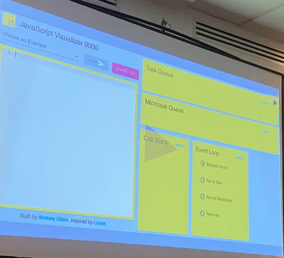

## The dark secrets of the event loop rxjs - st Laurent 3 - Gerard Sans

**Introduction:**

Understanding the event loop in JavaScript is crucial for optimizing browser performance. By comprehending the intricacies of task queues, microtasks, and the event loop's operation, developers can ensure efficient script execution and enhance user experience.

**The Event Loop Overview:**

- **Purpose and Importance:**
  - The event loop serves as a critical mechanism for managing asynchronous tasks and maintaining browser performance.
  - It orchestrates the execution of scripts, tasks, and microtasks to prevent blocking and ensure smooth user interactions.

- **Execution Phases:**
  - **Evaluate Script Phase:** Synchronously executes scripts, akin to a function body, until the call stack is empty.
  - **Run Task Phase:** Executes tasks from the task queue.
  - **Run Microtasks Phase:** Processes all microtasks from the microtask queue.
  - **Rerender Phase:** Triggers rendering updates based on changes in state or DOM manipulation.

**Understanding the Rendering Cycle:**

- **Order of Execution:**
  - Async events, DOM events, HTTP requests, and promises are processed in a specific order during each rendering cycle, constituting a single tick.

**Macro vs. Microtasks:**

- **Differentiating Tasks:**
  - Macro tasks, such as setTimeout callbacks, are handled after microtasks in the event loop.
  - Micro tasks, including promises, are prioritized and executed before macro tasks, ensuring timely updates and responsiveness.

- **Impact on Timing:**
  - Microtasks' execution does not contribute to macro task timing, allowing them to be processed independently.
  - Delays in microtask execution can affect the timing of macro tasks, influencing the expected behavior of functions like setInterval.

- **Understanding Delay:**
  - setTimeout's delay serves as a timer to enter the event loop rather than an exact timing mechanism, influencing task prioritization.

**Conclusion:**

Mastering the event loop in JavaScript is essential for optimizing browser performance and ensuring responsive web applications. By grasping the nuances of task queues, microtasks, and the event loop's execution phases, developers can write more efficient code, minimize blocking operations, and deliver exceptional user experiences in their web applications.

- # [Official slides](https://github.com/confooca/2024/tree/main)